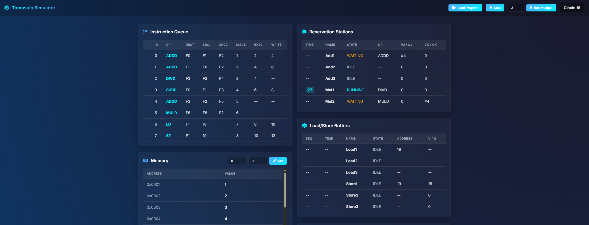

# Tomasulo Simulator

## Why This is a Fascinating Project
Computer architecture is the foundation of modern computing, and understanding how processors execute instructions out-of-order is key to grasping modern CPU performance. This project brings a highly complex, historically invisible hardware algorithm into the visual realm. It allows students, developers, and architecture enthusiasts to actually *see* out-of-order execution happen in real-time, bridging the gap between theoretical textbooks and practical understanding.

## What's Great About Tomasulo's Algorithm
Developed by Robert Tomasulo in 1967 for the IBM System/360 Model 91, Tomasulo's algorithm completely revolutionized computer architecture. It enables **dynamic scheduling** of instructions, allowing a processor to execute instructions out of their original order while still preserving mathematical correctness and data dependencies. 

By introducing **Reservation Stations** and **Register Renaming**, the algorithm elegantly solves Read-After-Write (RAW), Write-After-Write (WAW), and Write-After-Read (WAR) data hazards, which are the primary bottlenecks in standard pipelined execution. It is the architectural grandfather of the sophisticated out-of-order execution engines found in almost all high-performance CPUs today (from Apple Silicon to Intel Core processors).

## What The Project Does
This web application is a step-by-step visual simulator of Tomasulo's algorithm. It allows users to:
- **Load Custom Assembly Programs:** Input a sequence of floating-point operations (e.g., ADDD, MULD, LD, ST).
- **Step-by-Step Execution:** Step through the simulation manually, clock cycle by clock cycle.
- **Visualize the Pipeline:** Watch instructions dynamically move through the Issue, Execute, and Write Result phases.
- **Inspect Hardware Structures:** Monitor the real-time state of the Instruction Queue, Reservation Stations, Load/Store Buffers, Main Memory, and Floating-Point Registers.

## How It's Implemented & Strategic Choices
The simulator has been completely modernized from its legacy script-based origins into a robust, high-performance web application.

### Tech Stack
- **Framework:** Vue 3 (Composition API) powered by Vite.
- **Language:** Strict TypeScript.
- **Styling:** Custom Vanilla CSS utilizing modern glassmorphism, CSS Grid/Flexbox, and sleek gradients for a premium dark-mode aesthetic.

### Strategic Choices
1. **Decoupled Architecture:** The core simulation algorithm (`simulator.ts`) is entirely decoupled from the UI layer. It runs as pure TypeScript logic, managing state deterministically. This ensures the algorithm remains robust, testable, and completely independent of the rendering framework.
2. **Reactivity via Vue 3:** By wrapping the simulator's global state in Vue 3's `reactive` API, the UI automatically and instantly reflects the complex underlying hardware changes without the need for manual, error-prone DOM manipulation.
3. **Type Safety for Hardware State:** Using strict TypeScript classes for hardware concepts like `QandV` (Value or Tag tracking), `ReservationStations`, and `Registers` prevents classic JavaScript runtime errors. This is absolutely critical when simulating rigid, state-heavy hardware structures.
4. **Premium Visual Design:** To make learning computer architecture engaging, the design moves away from clinical, utilitarian designs (like older CSS frameworks) and embraces a modern, sleek interface with glassmorphism and micro-animations. This premium feel makes the complex data flow much easier to track visually and provides a significantly better user experience.
